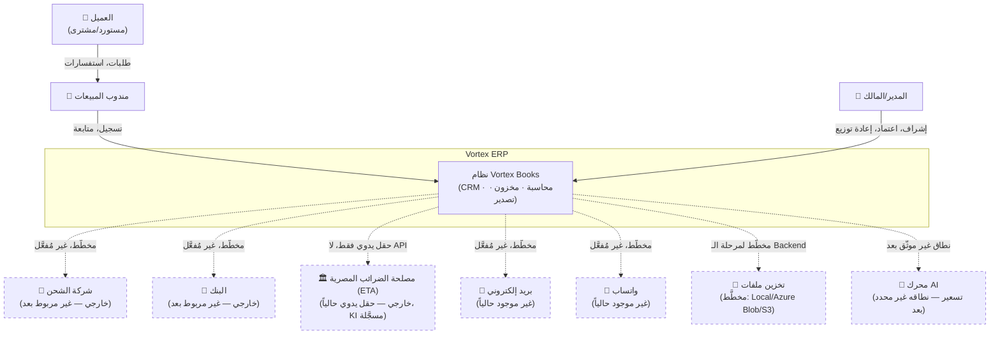
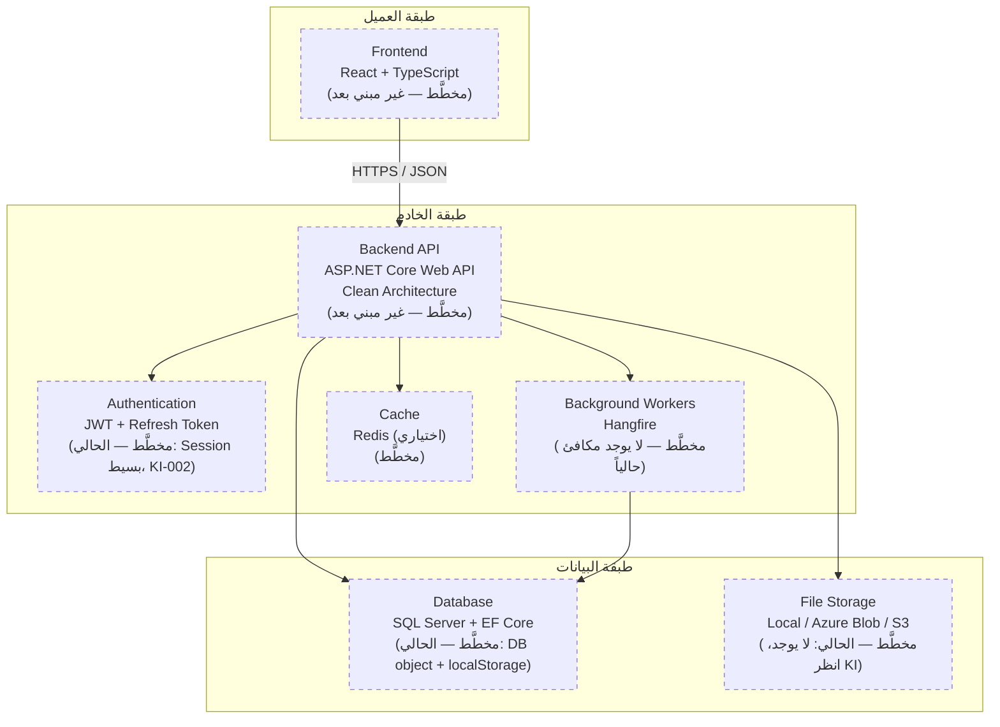

# 06 — Architecture (المعمارية)

## Document Information
```
Document Name:  Architecture
Version:        0.2.0
Status:         In Review
Classification: Source of Truth
Owner:          Solution Architecture Team
Approved-by:    —
Approved-date:  —
Last-Updated:   2026-07-18
```

> **حالة الملف:** يبدأ بقسمين فقط (System Context + Container Diagram) لأنهما الوحيدان القابلان للبناء دلوقتي بلا مخاطرة افتراض. باقي الأقسام (Module Boundaries, Data Flow, Event Flow, Authentication/Authorization Flow, ...) تُضاف تباعاً بعد استخراج كل موديول من `03_Business_Logic/` — إضافتها الآن ستكون تخمينًا، لا توثيقًا.
> **المصدر:** `docs/00_Project/Current_State.md` (قسم 4 — Target Stack) + `docs/02_Governance/Known_Issues.md` (الفجوات الحالية). لا افتراض جديد غير مبني على هذين المرجعين.

---

## System Context



### ملاحظات صريحة على الرسم أعلاه
- **الخطوط المتقطعة = تكامل غير موجود فعلياً بعد** (موثَّق كفجوة في `Current_State.md` قسم 3، أو كملاحظة في `Known_Issues.md`). الرسم بيوضح الطموح المعماري، مش الواقع الحالي — الفرق مقصود ومهم.
- **"محرك AI"** ظاهر في الرسم لأنه مذكور في `Current_State.md` (قرارات معلّقة: "AI pricing — ما مصدر بيانات التدريب؟")، لكن نطاقه ووظيفته الدقيقة **غير موثَّقين بعد** — أي تفصيل إضافي هنا يكون اختراعاً.
- **العميل** لا يتفاعل مع النظام مباشرة حالياً (لا Customer Portal — مذكور في `Current_State.md` كخطة v1.5+)، تفاعله كله عبر مندوب المبيعات.

---

## Container Diagram



### ملاحظات صريحة على الرسم أعلاه
- **كل عنصر في الرسم "مخطَّط" وليس مبنياً بعد** — هذا الرسم يعكس الـ Target Stack المعتمد في `Current_State.md` (قسم 4) حرفياً، وليس معمارية قائمة فعلاً. الوضع الحالي الوحيد الموجود فعلياً هو الـ Prototype أحادي الملف (`reference/prototype/prototype_v2.html`) بلا أي من هذه الطبقات.
- **`CompanyId` (Multi-tenant):** غير ظاهر كعنصر منفصل في هذا الرسم لأنه ليس Container، لكنه **قيد تصميم على مستوى الـ Database** من اليوم الأول (مبدأ حاكم في `Current_State.md` قسم 6، بند 2) — يُذكر هنا لتفادي فهمه كتفصيل منسي.
- **Cache (Redis):** مذكور كـ"اختياري" في المصدر — لا يُعتبر التزاماً معمارياً ثابتاً، بل قرار أداء لاحق.

---

## Open Questions (تحتاج قرار الفريق قبل البناء الفعلي — ليست جزءاً من الرسم المعتمد)

### 1. استراتيجية الموبايل (Mobile Strategy)
**السياق:** الـ Prototype الحالي (`reference/prototype/prototype_v2.html`) مُتجاوب فعلياً على متصفح الموبايل (viewport meta + أكثر من 20 نقطة `@media`)، لكنه **ويب فقط** — لا يوجد تطبيق iOS/Android حقيقي، ولا PWA (لا `manifest.json` ولا Service Worker)، فلا يمكن تثبيته كأيقونة أو تفعيل إشعارات Push رسمياً. موثَّق بالتفصيل في `docs/02_Governance/Known_Issues.md` (KI-006 لجزئية السحب/الإفلات تحديداً).

**القرار المطلوب من الفريق عند بدء بناء الـ Frontend (React) فعلياً — إحدى 3 خيارات:**

| الخيار | الوصف | التكلفة/الأثر |
|---|---|---|
| **Responsive Web فقط** | استمرار الوضع الحالي — موقع متجاوب بلا تثبيت | الأرخص والأسرع، لا Push Notifications، لا أيقونة على الشاشة الرئيسية |
| **PWA** | إضافة `manifest.json` + Service Worker فوق React | مجهود متوسط، تثبيت كأيقونة + عمل جزئي Offline + Push (حسب المتصفح) |
| **تطبيق Native** | React Native أو Flutter منفصل | أفضل تجربة لمس (خصوصاً شاشة Kanban في CRM)، لكن كود منفصل ومضاعفة تكلفة الصيانة |

**لا يُحسم هذا القرار في هذه الوثيقة** — يُسجَّل هنا فقط ليُطرح كـ ADR جديد عند الوصول لمرحلة بناء الـ Frontend، بدل أن يُنسى أو يُقرَّر ارتجالاً وقتها.

---

## الأقسام القادمة (لم تُبنَ بعد — بانتظار استخراج الموديولات)
Module Boundaries · Data Flow · Event Flow · Authentication Flow · Authorization Flow · File Storage Architecture · Background Jobs · Notification Flow · Reporting Flow · Integration Points · AI Integration Strategy · Deployment Overview

كل قسم من دول محتاج معرفة تفصيلية بمنطق موديول واحد على الأقل قبل رسمه بدقة (مثال: Authorization Flow محتاج تفاصيل من كل ملف Business Logic، مش من CRM بس) — إضافته الآن ستُبنى على تعميم غير موثّق.
